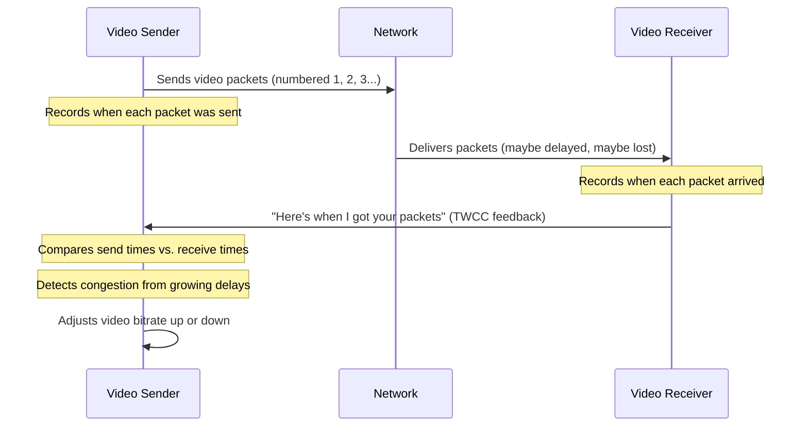
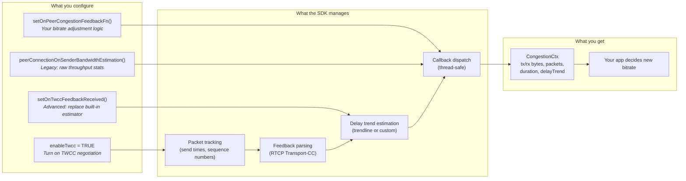

# Transport-Wide Congestion Control (TWCC)

## What is TWCC?

When you're on a video call and your network gets congested, the video quality should drop gracefully rather than freezing entirely. TWCC is the mechanism that makes this happen. It continuously monitors network conditions and tells the video encoder to send less data when the network is struggling, and more data when conditions improve.

### The problem TWCC solves

Without congestion control, a video sender has no idea whether its packets are arriving on time, arriving late, or being dropped entirely. It would keep blasting data at a fixed rate, overwhelming congested links and causing:
- Packet loss (video artifacts, glitches)
- Bufferbloat (ever-increasing latency)
- Stalls

TWCC provides the feedback loop that closes this gap.

### How it works (the simple version)



1. The **sender** numbers each outgoing video/audio packet sequentially
2. The **receiver** notes when each numbered packet arrives and periodically reports this back
3. The **sender** compares "when I sent it" vs. "when they got it" to detect congestion
4. Based on this analysis, the sender tells the encoder to increase or decrease quality

---

## How it works (the protocol details)

TWCC is defined in [draft-holmer-rmcat-transport-wide-cc-extensions](https://datatracker.ietf.org/doc/html/draft-holmer-rmcat-transport-wide-cc-extensions-01). It operates at the RTP/RTCP layer:

- **RTP header extension**: Each outgoing RTP packet carries a transport-wide sequence number (distinct from the per-SSRC RTP sequence number). This is negotiated via SDP `extmap`.
- **RTCP feedback (type 205, fmt 15)**: The receiver sends compact reports containing base sequence number, packet status count, and per-packet receive delta timestamps.
- **Sender-side estimation**: Unlike REMB (receiver-side), TWCC keeps the bandwidth estimation algorithm on the sender where it can be iterated without protocol changes.

### SDP negotiation

For TWCC to activate, the SDP offer/answer must include both:
```
a=extmap:<id> http://www.ietf.org/id/draft-holmer-rmcat-transport-wide-cc-extensions-01
a=rtcp-fb:<pt> transport-cc
```

The SDK handles this automatically when TWCC is enabled.

---

## Quick Start

For most applications using the **GStreamer samples**, TWCC "just works" with the sample configuration:

```c
// TWCC is enabled by default. To use the sample's built-in AIMD controller:
pSampleConfiguration->enableTwcc = TRUE;  // already the default

// The sample configuration sets the KvsRtcConfiguration value to enable TWCC when the `enableTwcc` flag is enabled:
KvsRtcConfiguration.disableSenderSideBandwidthEstimation = FALSE;

// The sample automatically registers sampleOnPeerCongestionFeedback,
// which adjusts video/audio bitrate based on loss and delay signals.
```

> [!NOTE]
> The TWCC bitrate adaptation is only implemented in the **GStreamer-based samples** (`kvsWebrtcClientMasterGstSample`, `kvsWebrtcStorageAudioVideoMasterGstSample`, etc.). The non-GStreamer samples (`kvsWebrtcClientMaster`) do not have encoder bitrate control since they send pre-encoded frames from file, there is no live encoder to adjust.

---

## SDK Implementation

This SDK implements TWCC with a pluggable architecture: a built-in delay estimator handles the default case, while applications can register custom callbacks to run their own bandwidth estimation algorithms.

### Where you plug in (configuration points)



---

## API Reference

### Enabling TWCC

TWCC is enabled by default in the sample application (`createSampleConfiguration` sets `pSampleConfiguration->enableTwcc = TRUE`).

The sample configures the PeerConnectionConfiguration with `KvsRtcConfiguration.disableSenderSideBandwidthEstimation = FALSE` to enable TWCC.

### Callbacks

The SDK provides three callback registration points, ordered from most common to most advanced:

| Callback                                    | When to use                                                                                                 | What you receive                                                                                                                                                           |
|---------------------------------------------|-------------------------------------------------------------------------------------------------------------|----------------------------------------------------------------------------------------------------------------------------------------------------------------------------|
| `setOnPeerCongestionFeedbackFn`             | To adjust bitrate based on network conditions.                                                              | `CongestionCtx` containing: tx/rx bytes, tx/rx packet counts, measurement duration, and `delayTrend` (positive = congestion building).                                     |
| `setOnTwccFeedbackReceived`                 | To replace the SDK's built-in delay estimator (EMA-smoothed OLS linear regression) with your own algorithm. | Per-packet `TwccFeedback` array (send time, receive time, packet size for each packet) and a `TwccCongestionState` struct where you write back your computed `delayTrend`. |
| `peerConnectionOnSenderBandwidthEstimation` | **Deprecated.** Provides raw throughput numbers without delay analysis.                                     | tx/rx bytes, tx/rx packet counts, and measurement duration                                                                                                                 |

### Callback priority and interaction

```
onTwccFeedbackReceived (if set)     ─┐
         OR                          ├── calculates delayTrend (slope)
built-in estimator                  ─┘
                                               │
                                               ▼
                            onPeerCongestionFeedback (if set)  -- bitrate adjustment logic
                            onSenderBandwidthEstimation (if set) -- legacy, same data
```

- Setting `onTwccFeedbackReceived` **replaces** the built-in OLS linear regression estimator. Your application takes full responsibility for computing delay trends.
- Regardless of which estimator produced the delay trend, `onPeerCongestionFeedback` and `onSenderBandwidthEstimation` (if set) are invoked.

### Override Points

The TWCC pipeline has three stages, each with a default behavior you can override independently:

| Stage                      | What it does                                                       | Default                                                    | Override with                                                                      | When to override                                                                                    |
|----------------------------|--------------------------------------------------------------------|------------------------------------------------------------|------------------------------------------------------------------------------------|-----------------------------------------------------------------------------------------------------|
| **1. Delay estimation**    | Converts per-packet timing into a congestion signal (`delayTrend`) | Built-in EMA-smoothed OLS trendline                        | `setOnTwccFeedbackReceived(pPeerConnection, customData, fn)`                       | You have a better estimator (e.g., GCC, SCReAM, or ML-based)                                        |
| **2. Congestion decision** | Receives `delayTrend` + throughput stats, decides new bitrate      | Sample AIMD controller (`sampleOnPeerCongestionFeedback`)  | `setOnPeerCongestionFeedbackFn(pPeerConnection, customData, fn)`                   | You want different AIMD thresholds, a different algorithm, or to feed into your own rate controller |
| **3. Bitrate application** | Applies the new bitrate to the media encoder                       | GStreamer `g_object_set` on the encoder element each frame | Write your own logic that reads `twccMetadata.newVideoBitrate` / `newAudioBitrate` | You're not using GStreamer, or need encoder-specific commands (e.g., hardware encoder API)          |

<details>
<summary>Code examples for each override point</summary>

**Example 1: Override the estimator** (replace trendline with your own algorithm):

```c
STATUS myEstimator(UINT64 customData, PTwccFeedback pFeedback, UINT32 count,
                   PTwccCongestionState pState) {
    // pFeedback[i].sendTime   — when we sent packet i (hundreds of ns)
    // pFeedback[i].recvTime   — when remote received packet i (hundreds of ns)
    // pFeedback[i].packetSize — bytes
    // pFeedback[i].twccSeqNum — transport-wide sequence number

    DOUBLE mySlope = runMyAlgorithm(pFeedback, count);
    pState->delayTrend = mySlope;  // Send the calculated slope to the module responsible for the bitrate decision
    return STATUS_SUCCESS;
}

setOnTwccFeedbackReceived(pPeerConnection, (UINT64) myApp, myEstimator);
// Note: onPeerCongestionFeedback fires with YOUR mySlope value
```

**Example 2: Override only the decision stage** (keep built-in estimator, custom bitrate logic):

```c
STATUS myBitrateCallback(UINT64 customData, PCongestionCtx pCtx) {
    MyApp* app = (MyApp*) customData;

    // pCtx->congestionState.delayTrend  — from built-in estimator (ms)
    // pCtx->txPackets, pCtx->rxPackets  — packet counts this interval
    // pCtx->txBytes, pCtx->rxBytes      — byte counts this interval
    // pCtx->duration                    — measurement window (hundreds of ns)

    // Your logic here...
    app->targetBitrate = computeMyBitrate(pCtx);
    return STATUS_SUCCESS;
}

setOnPeerCongestionFeedbackFn(pPeerConnection, (UINT64) myApp, myBitrateCallback);
```

**Example 3: Override bitrate application** (non-GStreamer encoder):

```c
// In your frame-sending loop, instead of relying on GStreamer's on_new_sample:
MUTEX_LOCK(pSession->twccMetadata.updateLock);
if (pSession->twccMetadata.newVideoBitrate != 0) {
    myEncoder_setBitrate(encoder, pSession->twccMetadata.newVideoBitrate);
    pSession->twccMetadata.newVideoBitrate = 0;
}
MUTEX_UNLOCK(pSession->twccMetadata.updateLock);
```

</details>

---

## Built-in Default Trendline Estimator

The default estimator (`computeTwccTrendline`) detects congestion by measuring whether packets are arriving with increasing delays relative to when they were sent.

### Intuition

Imagine sending packets at a steady 10ms interval. If the receiver reports them arriving at 10ms, 10ms, 11ms, 12ms, 14ms intervals, the gaps are growing. Something along the path is queuing packets. The trendline estimator detects this slope.

<details>
<summary>Algorithm details (OLS regression + EMA smoothing)</summary>

1. **Inter-packet delay variation**: For each **consecutive pair** of acknowledged packets:
   ```
   delay_variation = (recv_gap) - (send_gap)
   ```
   Positive means the network added delay between those two packets.

2. **Accumulated delay**: Running sum of all delay variations. Tracks total queuing buildup over time.

3. **Linear regression (OLS)**: Fits a line through the accumulated delay samples. The slope tells us: is delay growing (positive slope = congestion), stable (zero = fine), or shrinking (negative = recovering)

4. **EMA smoothing**: Filters out short-term jitter so we only react to sustained trends:
   ```
   smoothed = alpha * raw_slope + (1 - alpha) * previous_smoothed
   ```

5. **Output**: `delayTrend` in milliseconds. This single number drives the bandwidth decision.

</details>

---

## Sample Application: AIMD Bitrate Controller

The included sample (`sampleOnPeerCongestionFeedback` in `samples/common/Common.c`) demonstrates an AIMD (Additive Increase, Multiplicative Decrease) controller that combines both loss-based and delay-based signals.

Feel free to modify the values to your use case and application requirements.

### How decisions are made

The sample bandwidth controller uses two independent signals and reacts to whichever indicates worse conditions:

| Signal      | How it's measured                                      |  Congested threshold |  Clear threshold |
|-------------|--------------------------------------------------------|---------------------:|-----------------:|
| Packet loss | `(tx_packets - rx_packets) / tx_packets`, EMA smoothed |                 > 5% |            <= 2% |
| Delay trend | Output of trendline estimator                          |             > 0.5 ms |        < -0.1 ms |

When congestion is detected, the controller **multiplicatively decreases** the bitrate. When conditions are clear, it **additively increases** in small steps. Adjustments are rate-limited to `TWCC_BITRATE_ADJUSTMENT_INTERVAL_MS` to prevent oscillation.

<details>
<summary>Detailed AIMD factor tables</summary>

#### Decreasing bitrate (congestion detected)

When either signal indicates congestion, the more severe the congestion, the larger the cut:

| Condition                             | Reduction factor  | Example: 2000 kbps →   |
|---------------------------------------|:-----------------:|-----------------------:|
| Delay trend > 5.0 ms (severe queuing) |       0.50        |              1000 kbps |
| Delay trend > 1.0 ms                  |       0.70        |              1400 kbps |
| Loss > 10%                            |       0.70        |              1400 kbps |
| Delay trend > 0.5 ms (mild)           |       0.95        |              1900 kbps |
| Loss > 5%                             |       0.85        |              1700 kbps |

When both signals indicate congestion, the **minimum** (most aggressive) factor wins.

#### Increasing bitrate (network is clear)

Feel free to modify the values in the `sampleOnPeerCongestionFeedback` to your use case and application requirements.

| Condition | Video step | Audio step |
|-----------|:----------:|:----------:|
| Both loss AND delay clear | +MAX_VIDEO/40 per interval | +MAX_AUDIO/20 per interval |
| Only one signal clear | +MAX_VIDEO/80 per interval | +MAX_AUDIO/20 per interval |
| Both neutral (not congested, not clear) | Hold (no change) | Hold (no change) |

</details>

### Bitrate bounds (CLAMP)

After every AIMD decision, the resulting bitrate is clamped to a `[min, max]` range so the encoder never receives an unreasonably low or high target:

```c
// Equivalent to: CLAMP(bitrate, min, max)
videoBitrate = MAX(MIN(videoBitrate, MAX_VIDEO_BITRATE_KBPS), MIN_VIDEO_BITRATE_KBPS);
audioBitrate = MAX(MIN(audioBitrate, MAX_AUDIO_BITRATE_BPS), MIN_AUDIO_BITRATE_BPS);
```

The defaults are defined in `samples/common/Samples.h`, you can customize them to your application requirements.

| Constant                 | Default value | Unit | Notes                                      |
|--------------------------|:-------------:|------|--------------------------------------------|
| `MIN_VIDEO_BITRATE_KBPS` |      384      | kbps | Floor - prevents unwatchable video quality |
| `MAX_VIDEO_BITRATE_KBPS` |     2500      | kbps | Ceiling - caps bandwidth usage             |
| `MIN_AUDIO_BITRATE_BPS`  |     4000      | bps  | Floor - preserves intelligible audio       |
| `MAX_AUDIO_BITRATE_BPS`  |    128000     | bps  | Ceiling - caps audio bandwidth             |

**Why it matters:**
- The **min** prevents the controller from spiraling down to near-zero during transient congestion. Without it, recovery takes a long time since additive increase climbs slowly.
- The **max** caps bandwidth usage to protect other traffic sharing the link, and prevents overshooting what the encoder or resolution can usefully consume.

> [!TIP]
> If your min and max are equal (or nearly equal), the AIMD controller effectively becomes fixed-rate - the clamp overrides every adjustment. This is a common cause of "callbacks fire but bitrate doesn't change" (see [Troubleshooting](#bitrate-not-changing-despite-callbacks-firing)).

### How the GStreamer sample applies the new bitrate

The congestion callback writes a target bitrate into shared memory. The GStreamer pipeline picks it up on the next frame via its `on_new_sample` callback (`samples/common/GstMedia.c`):

<details>
<summary>GStreamer bitrate application code</summary>

```c
// Inside the GStreamer appsink on_new_sample callback, for each frame:
GstElement* encoder = gst_bin_get_by_name(GST_BIN(senderPipeline), "sampleVideoEncoder");
if (encoder != NULL) {
    // Get the current bitrate
    g_object_get(G_OBJECT(encoder), "bitrate", &bitrate, NULL);

    MUTEX_LOCK(pSampleStreamingSession->twccMetadata.updateLock);
    // Record current encoder bitrate (so AIMD logic knows where we are)
    pSampleStreamingSession->twccMetadata.currentVideoBitrate = (UINT64) bitrate;

    // If the congestion callback wrote a new target, apply it
    if (pSampleStreamingSession->twccMetadata.newVideoBitrate != 0) {
        bitrate = (guint)(pSampleStreamingSession->twccMetadata.newVideoBitrate);
        pSampleStreamingSession->twccMetadata.newVideoBitrate = 0;
        g_object_set(G_OBJECT(encoder), "bitrate", bitrate, NULL);
    }
    MUTEX_UNLOCK(pSampleStreamingSession->twccMetadata.updateLock);
}
```

This pattern decouples the RTCP processing thread (where the congestion callback fires) from the GStreamer media thread (where the encoder lives). The `updateLock` mutex ensures they don't race.

The same pattern applies to audio with `"sampleAudioEncoder"` and `twccMetadata.newAudioBitrate`.

</details>

---

## Troubleshooting

### TWCC not activating

TWCC requires **all three** conditions to be true. If any one is missing, the SDK logs a message and TWCC silently stays off.

**Check the SDP.** Look at the remote offer or answer for these two lines in each media section (`m=audio` / `m=video`):

```
a=extmap:<id> http://www.ietf.org/id/draft-holmer-rmcat-transport-wide-cc-extensions-01
a=rtcp-fb:<payload-type> transport-cc
```

| Condition                                  | What to look for in SDP                               | SDK log if missing                                |
|--------------------------------------------|-------------------------------------------------------|---------------------------------------------------|
| 1. Remote advertises TWCC extension        | `a=extmap:` line containing the URL above             | `TWCC not advertised by remote (extmap=no, ...)`  |
| 2. Remote advertises transport-cc feedback | `a=rtcp-fb:<pt> transport-cc`                         | `TWCC not advertised by remote (..., rtcp-fb=no)` |
| 3. Local TWCC enabled                      | `pTwccManager != NULL` (set when `enableTwcc = TRUE`) | `TWCC disabled by local configuration`            |

**Common causes:**
- The remote peer doesn't support TWCC
- The remote peer only advertises TWCC on video but not audio (this is normal for Firefox — TWCC will be enabled per-transceiver only where both sides agree)
- `KvsRtcConfiguration.disableSenderSideBandwidthEstimation` is `TRUE` (TWCC is disabled by the local PeerConnection configuration)

### TWCC enabled but callbacks never fire

**Symptom:** `"TWCC enabled, ext id: X"` appears in logs, but your congestion callback never gets called.

| Possible cause                        | How to check                                                                                                                                                |
|---------------------------------------|-------------------------------------------------------------------------------------------------------------------------------------------------------------|
| No packets sent yet                   | Callbacks only fire after you call `writeFrame` and the remote sends feedback back. Ensure media is flowing.                                                |
| Remote peer not sending RTCP feedback | Use Wireshark or tcpdump to check for incoming RTCP packets (port same as RTP, type 205 fmt 15). Some peers have long feedback intervals.                   |
| Callback not registered               | Ensure `setOnPeerCongestionFeedbackFn` (or the legacy BWE callback) is called **before** the session starts.                                                |
| Duration is zero                      | The SDK only invokes `onPeerCongestionFeedback` when the measurement window `duration > 0`. If all packets in a report are lost, duration computes to zero. |

### Bitrate not changing despite callbacks firing

**Symptom:** `"BWE: ..."` log lines show up but encoder bitrate stays constant.

| Possible cause                      | How to check                                                                                                                                                                         |
|-------------------------------------|--------------------------------------------------------------------------------------------------------------------------------------------------------------------------------------|
| Encoder element not named correctly | GStreamer integration looks for elements named `"sampleVideoEncoder"` / `"sampleAudioEncoder"`. If yours have different names, the `gst_bin_get_by_name` call returns NULL silently. |
| `updateLock` contention             | If your frame-sending thread never acquires the lock, bitrate updates pile up. Check for deadlocks or long lock holds.                                                               |
| Bitrate clamped to min/max          | The sample clamps to `MIN_VIDEO_BITRATE_KBPS` / `MAX_VIDEO_BITRATE_KBPS`. If min == max or both are set to the same value, no visible change occurs.                                |
| Not using GStreamer                  | The bitrate application code is GStreamer-specific. If you're using a custom encoder, you need to read `twccMetadata.newVideoBitrate` yourself (see Override Points above).           |

### Useful log messages

Set log level to `DEBUG` to see TWCC diagnostics. Key messages to look for:

<details>
<summary>Log message reference</summary>

| Log message                                                      | What it means                                                                                                            |
|------------------------------------------------------------------|--------------------------------------------------------------------------------------------------------------------------|
| `TWCC enabled, ext id: <N>`                                      | TWCC negotiated successfully. `N` is the RTP extension ID.                                                               |
| `TWCC disabled by local configuration`                           | `enableTwcc` is FALSE or pTwccManager wasn't created.                                                                    |
| `TWCC not advertised by remote (extmap=X, rtcp-fb=Y)`            | Remote SDP missing one or both required attributes.                                                                      |
| `TWCC trendline: delayTrend=X ms queueDelay=Y ms (n=Z)`          | Built-in estimator output. Positive delayTrend = congestion.                                                             |
| `BWE: pktLoss=X% delayTrend=Y ms factor=Z`                       | Sample AIMD controller made a bitrate decision. Shows current loss, delay trend, scaling factor, and resulting bitrates. |
| `Malformed TWCC packet: packetStatusCount is 0, skipping`        | Received an empty feedback report (harmless, just skipped).                                                              |
| `Malformed TWCC packet: reportLen X exceeds packetStatusCount Y` | Possible bug in remote peer's TWCC implementation; SDK clamps safely.                                                    |
| `Number of TWCC info packets in memory: N`                       | Logged on cleanup. Large values may indicate feedback wasn't arriving (packets accumulated without being reported).      |

</details>
